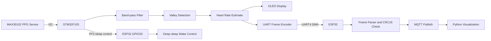
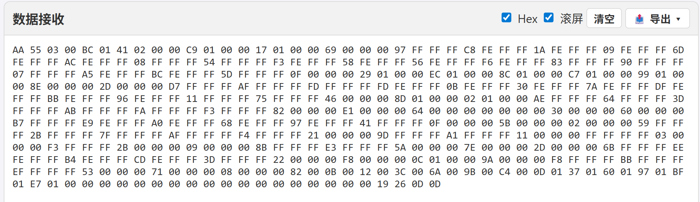
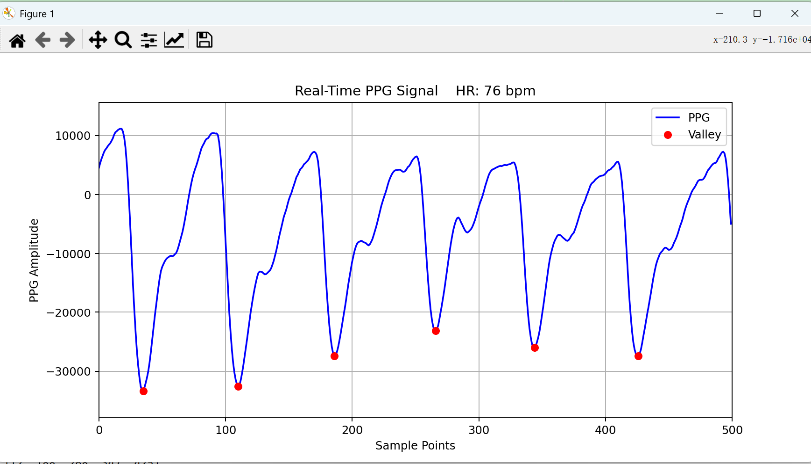

# STM32 + MAX30102 FreeRTOS MQTT Heart Rate Monitor

基于 STM32F103、MAX30102 和 ESP32 的实时 PPG 心率采集与 MQTT 上传系统。STM32 端负责传感器采样、数字滤波、心率估算、OLED 显示、UART DMA 上传和自动低功耗控制；ESP32 端负责 UART 数据帧解析、CRC 校验、WiFi 连接、MQTT 发布和 Deep-sleep 协同。

> 本项目用于嵌入式实时采集、通信协议和低功耗链路演示，不用于医疗诊断。

## 项目特点

- STM32 FreeRTOS 多任务：传感器采样、PPG 处理、OLED 显示、UART 上传、低功耗检测分离运行
- MAX30102 PPG 原始数据采集，0.5 Hz 到 4 Hz 带通滤波，基于滑动窗口的波谷检测和心率估算
- UART4 + DMA 自定义帧协议，包含帧头、序号、长度、Payload、CRC16 和帧尾
- ESP32 流式 UART 解析器，支持粘包、错位、CRC 错误和丢帧检测
- ESP32 WiFi STA + MQTT JSON 发布，状态 Topic 使用 retained online/offline 消息
- 自动 Stop/Deep-sleep 机制：STM32 进入 STOP mode 时关闭 OLED、关闭 MAX30102、拉低控制脚通知 ESP32 进入 Deep-sleep
- Python MQTT 客户端实时绘制 PPG 波形、波谷点和心率值

## 系统架构



## 低功耗流程

1. STM32 低功耗检测任务收到外部中断通知后，确认 PE3 为低电平。
2. STM32 关闭 OLED 显示，调用 MAX30102 shutdown，PF0 输出低电平，通知 ESP32 停止上传。
3. STM32 挂起 HAL tick，清除 EXTI pending bit，进入 STOP mode。
4. ESP32 检测 GPIO32 为低电平后，暂停 UART 接收任务，最多等待 1 秒清空待上传队列，暂停 MQTT 发送任务，断开 WiFi 并进入 Deep-sleep。
5. GPIO32 恢复高电平后唤醒 ESP32；STM32 从 STOP mode 唤醒后恢复系统时钟、OLED、MAX30102 和上传控制脚。

## 目录结构

```text
.
├── stm32-max30102-ppg/      # STM32F103 + MAX30102 采集、处理、显示、低功耗控制
│   ├── Core/
│   ├── Drivers/
│   ├── Middlewares/
│   ├── cmake/
│   ├── CMakeLists.txt
│   └── CMakePresets.json
├── wifi_mqtt/               # ESP32 WiFi + UART + MQTT + Deep-sleep 工程
│   ├── components/
│   │   ├── APP_MQTT/
│   │   ├── MYUART/
│   │   ├── SLEEP/
│   │   └── WIFISTA/
│   ├── main/
│   │   ├── Kconfig.projbuild
│   │   └── wifi_mqtt.c
│   └── CMakeLists.txt
├── mqtt_client.py            # Python MQTT 实时波形客户端
├── LICENSE
├── 串口.png                  # UART 帧接收示例
└── python接收端.png           # Python 实时波形显示示例
```

## 核心代码

| 模块 | 文件 | 说明 |
| --- | --- | --- |
| MAX30102 驱动与滤波 | `stm32-max30102-ppg/Core/Src/max30102.c` | 传感器初始化、FIFO 读取、带通滤波、滑动窗口 |
| STM32 任务编排 | `stm32-max30102-ppg/Core/Src/freertos.c` | FreeRTOS 任务、心率估算、OLED 显示、UART DMA 上传 |
| STM32 低功耗控制 | `stm32-max30102-ppg/Core/Src/lowpower.c` | STOP mode、OLED 关闭、MAX30102 shutdown、ESP32 上传控制 |
| CRC 与 CPU 统计 | `stm32-max30102-ppg/Core/Src/utils.c` | CRC16 和 CPU 使用率统计 |
| ESP32 UART 解析 | `wifi_mqtt/components/MYUART/myuart.c` | UART 初始化、流式帧解析、CRC 校验、丢帧检测 |
| ESP32 MQTT 发布 | `wifi_mqtt/components/APP_MQTT/mqtt.c` | MQTT 连接、状态消息、PPG JSON 发布 |
| ESP32 Deep-sleep | `wifi_mqtt/components/SLEEP/sleep.c` | GPIO32 睡眠请求检测、队列排空、WiFi stop、Deep-sleep |
| ESP32 WiFi STA | `wifi_mqtt/components/WIFISTA/wifista.c` | WiFi 初始化和 IP 获取事件处理 |

## 硬件连接

### STM32 与 MAX30102

| 功能 | STM32 引脚 | 说明 |
| --- | --- | --- |
| I2C1 SCL | PB6 | MAX30102 SCL |
| I2C1 SDA | PB7 | MAX30102 SDA |
| INT | PD12 | MAX30102 中断输入，下降沿触发 |

### STM32 与 ESP32

| 功能 | STM32 引脚 | ESP32 引脚 | 说明 |
| --- | --- | --- | --- |
| UART TX | PC10 / UART4_TX | GPIO18 / UART1_RX | STM32 向 ESP32 上传数据 |
| UART RX | PC11 / UART4_RX | GPIO17 / UART1_TX | 预留 |
| Sleep control | PF0 | GPIO32 | PF0 低电平请求 ESP32 进入 Deep-sleep，高电平唤醒 |
| GND | GND | GND | 共地 |

### STM32 低功耗触发

| 功能 | STM32 引脚 | 说明 |
| --- | --- | --- |
| Stop request | PE3 | 低电平触发 STM32 STOP mode 流程 |

默认 UART 参数：

```text
Baudrate: 230400
Data bits: 8
Parity: None
Stop bits: 1
Flow control: None
```

## 数据帧协议

```text
+----------+--------+--------+-------------+--------+----------+
| Header   | Seq    | Length | Payload     | CRC16  | Tail     |
| 2 bytes  | 2 bytes| 2 bytes| 444 bytes   | 2 bytes| 2 bytes  |
+----------+--------+--------+-------------+--------+----------+
| AA 55    | LE     | LE     | Trans_Data_t| LE     | 0D 0D    |
+----------+--------+--------+-------------+--------+----------+
```

Payload 结构：

```c
typedef struct __attribute__((packed)) {
    int32_t ppg[100];
    uint16_t heartrate;
    uint16_t valley_count;
    uint16_t valley_index[20];
} Trans_Data_t;
```

ESP32 发布到 MQTT 的 JSON 示例：

```json
{
  "heartrate": 76,
  "ppg": [482, 457, 361, -1280, -2634, -4210],
  "valley_count": 1,
  "valley_index": [2]
}
```

## 构建与烧录

### STM32 工程

可使用 STM32CubeIDE、CLion 或 CMake toolchain 打开 `stm32-max30102-ppg/`，根据本地 arm-none-eabi 工具链配置后编译烧录。

### ESP32 工程

环境要求：

- ESP-IDF
- ESP32 开发板

构建和烧录示例：

```powershell
cd wifi_mqtt
idf.py set-target esp32
idf.py menuconfig
idf.py build
idf.py -p COMx flash monitor
```

请将 `COMx` 替换为实际串口号。

## WiFi 与 MQTT 配置

WiFi 默认占位配置位于：

```c
wifi_mqtt/components/WIFISTA/wifista.h
```

MQTT Broker、Client ID、用户名、密码、PPG Topic、状态 Topic 和命令 Topic 通过 ESP-IDF menuconfig 配置：

```powershell
cd wifi_mqtt
idf.py menuconfig
```

进入 `PPG MQTT Gateway Configuration` 填写相关配置。

## Python 可视化客户端

安装依赖：

```powershell
pip install paho-mqtt matplotlib certifi
```

运行前修改 `mqtt_client.py` 顶部的 Broker、用户名、密码和 Topic 配置，然后启动：

```powershell
python mqtt_client.py
```

## 运行效果

UART 原始帧接收示例：



Python 端实时 PPG 波形显示：



## 许可证

本项目自有代码采用 MIT License。STM32 HAL、CMSIS、FreeRTOS、ESP-IDF 等第三方组件遵循其各自目录中的许可证。
